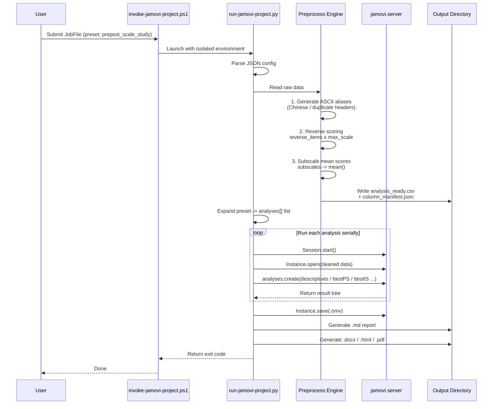

# Jamovi Analysis

> 🇨🇳 [查看中文版 README](README_zh.md)

Jamovi Analysis is an automation and integration layer designed to run programmatic and natural language-driven statistical analyses using a local [jamovi](https://www.jamovi.org/) installation. It bridges automated systems (scripts, AI agents) and the jamovi desktop application, allowing you to generate real `.omv` project files and extract statistical summaries — without ever opening the jamovi GUI.

---

## Project Structure

```
jamovi-analysis/
├── agents/
│   └── openai.yaml          # OpenAI agent interface configuration
├── assets/
│   └── apa-template.docx    # DOCX report template for APA output
├── examples/                # Runnable sample datasets + expected outputs
│   ├── cross_sectional_survey/
│   ├── prepost_scale_study/
│   ├── regression_study/
│   ├── reliability_study/
│   └── ttest_study/
├── references/
│   ├── analysis-map.md      # jmv function mapping & project-mode scope
│   ├── development-plan.md  # Development roadmap and completed phases
│   ├── install-layout.md    # Verified local jamovi installation paths
│   ├── output-templates.md  # Canonical extractor output keys & contracts
│   ├── project-mode.md      # JobFile schema, measurement rules & lifecycle
│   └── reporting-templates.md # APA 7th edition table templates
├── scripts/
│   ├── find-jamovi.ps1              # Auto-discovers jamovi install root
│   ├── invoke-jamovi-project.ps1    # Main entrypoint: generates .omv + Markdown report
│   ├── invoke-jamovi-r.ps1          # Batch R statistics via jamovi's bundled Rscript
│   ├── preflight-jamovi-project.ps1 # Capability check before real analyses
│   ├── run-jamovi-project.py        # Core Python runner (do not invoke directly)
│   └── start-jamovi-server.ps1      # Starts interactive jamovi.server process
├── src/jamovi_runner/       # Core Python package
│   ├── extract/             # Result extractors for 9 jamovi analyses
│   ├── reporters/           # Markdown/DOCX/HTML/PDF/LaTeX report generators
│   ├── formatting.py        # APA number/formatting utilities
│   ├── preprocess.py        # Data cleaning, aliasing, reverse scoring
│   ├── report.py            # Markdown report builder (GFM & APA 7th)
│   └── schema.py            # JobFile validation schema
├── templates/
│   ├── input/               # Starter CSV templates for 5 study types
│   └── output/              # Canonical APA markdown table templates
├── tests/                   # pytest suite (109 tests)
├── vendor/
│   └── jamovi-python/       # Vendored python-docx, markdown, lxml
├── pytest.ini               # Test configuration
├── SKILL.md                 # AI agent skill manifest
├── README.md                # This file (English)
└── README_zh.md             # Chinese README
```

---

## Core Features

### Canonical JobFile Interface

The **recommended** way to use this tool is through a unified **JobFile** — a single JSON configuration file that declares data source, preprocessing, analysis requests, locale, and output location.

```powershell
& '.\scripts\invoke-jamovi-project.ps1' -JobFile '.\temp\job.json'
```

Output controls:
- `output.table_style`: `gfm` (default) or `apa`.
- `output.export`: `{ enabled: true, formats: ["pdf", "html", "latex"] }`.
  If `output.export` is omitted, project mode now removes unsupported default formats such as `pdf` when `weasyprint` is unavailable.

### Data Preprocessing Layer

When invoked via JobFile (or when `request_kind` is `preset` / `structured`), the runner automatically:

1. **Reads raw data** (`.csv`, `.tsv`, `.xlsx`) with auto-detected delimiters and encoding.
2. **Generates safe ASCII aliases** for all column headers (Chinese, duplicate, or special-character headers → stable identifiers like `var_2`, `q24_rev`).
3. **Computes reverse-scored items** using `max_scale` (e.g., `q24=2` with `max_scale=5` → `q24_rev=4.0`).
4. **Calculates subscale mean scores** from item groups.
5. **Writes** a clean `analysis_ready.csv` and a `column_manifest.json` (alias ↔ original header mapping).

### Preflight

Run a standalone capability check before real analyses:

```powershell
& '.\scripts\preflight-jamovi-project.ps1'
```

The preflight reports:
- whether `python-docx`, `markdown`, and `weasyprint` are available
- which outputs are currently usable
- which default export formats will actually be enabled

Project mode no longer attempts runtime `pip install`. Optional report dependencies are expected to come from the repo-scoped vendor directory at `vendor/jamovi-python`.

### Preset Mode

For standard educational/psychology surveys, use `request_kind: "preset"` to automate the full analysis pipeline. Currently supported:

- **`prepost_scale_study`**: Automatically expands into:
  - `descriptives` (pre/post/delta subscales, split by group/cluster when provided)
  - `ttestPS` (paired pre vs post for each subscale)
  - `ttestIS` (delta by group when group_column is provided)

### APA 7th Edition Reporting

Set `output.table_style: "apa"` to generate publication-ready tables with:
- Automatic table numbering (*Table 1*, *Table 2*)
- Italicized statistical symbols (*M*, *SD*, *t*, *p*, *F*, *β*, *η²p*)
- Proper decimal formatting and leading-zero rules
- DOCX export with APA borders via `python-docx`

See `templates/output/` for canonical APA table templates and `references/reporting-templates.md` for the full specification.

### Chinese Locale Support

Set `locale: "zh"` in the JobFile (or use `-Locale zh` on the command line) to produce `.omv` project files with Chinese UI labels (e.g., "信度分析", "描述统计"). Defaults to `zh`.

### Per-Phase Timings

Both the JSON output and the Markdown report include a detailed timing breakdown:

```
Total Time: 3.29s
  Phases: Preprocess 0.00s | Open 0.60s | Run 1.81s | Save 0.06s
```

---

## Operating Modes

### 1. Project Mode — JobFile (Recommended)

**Preset mode** — fully automated survey analysis:
```json
{
  "data_path": "C:/data/raw_study.xlsx",
  "mode": "project",
  "locale": "zh",
  "request_kind": "preset",
  "preset": {
    "name": "prepost_scale_study",
    "id_column": "user_id",
    "group_column": "class_group",
    "max_scale": 5,
    "reverse_items": ["q24", "q25", "q26"],
    "subscales": {
      "creativity": ["q01", "q02", "q03"],
      "algorithmic": ["q09", "q10", "q11"]
    }
  },
  "output": {
    "dir": "C:/data/jamovi_outputs",
    "basename": "ct-core-analysis",
    "table_style": "gfm",
    "export": {
      "enabled": true,
      "formats": ["pdf", "html", "latex"]
    }
  }
}
```

```powershell
& '.\scripts\invoke-jamovi-project.ps1' -JobFile '.\temp\job.json'
```

**Structured mode** — specific analyses with preprocessing:
```json
{
  "data_path": "C:/data/study.csv",
  "mode": "project",
  "request_kind": "structured",
  "analyses": [
    {"analysis_type": "descriptives", "variables": {"vars": ["score", "age"], "splitBy": ["group"]}},
    {"analysis_type": "ttestIS", "variables": {"vars": ["score"], "group": "group"}}
  ],
  "output": {
    "basename": "study-report",
    "table_style": "gfm"
  }
}
```

### 2. Project Mode — Legacy CLI

Still supported for backward compatibility:

```powershell
# Natural Language
& '.\scripts\invoke-jamovi-project.ps1' `
  -DataPath 'C:\data\study.csv' `
  -Request 'Run descriptives for score and age'

# Structured JSON
& '.\scripts\invoke-jamovi-project.ps1' `
  -DataPath 'C:\data\study.csv' `
  -SpecJson '{"analysis_type":"ttestIS","variables":{"vars":["score"],"group":"group"}}'
```

### 3. R Batch Mode — Quick Terminal Statistics

```powershell
& '.\scripts\invoke-jamovi-r.ps1' -Code 'library(jmv); descriptives(data.frame(x=c(1,2,3,4,5)), vars="x")'
```

### 4. Interactive Server Mode

```powershell
& '.\scripts\start-jamovi-server.ps1'
```

---

## Supported Analyses (v1)

| Analysis | `jmv` Function | Extraction |
|---|---|---|
| Descriptive Statistics | `descriptives` | ✅ |
| Independent Samples T-Test | `ttestIS` | ✅ |
| Paired Samples T-Test | `ttestPS` | ✅ |
| One-Way ANOVA | `anovaOneW` | ✅ |
| Correlation Matrix | `corrMatrix` | ✅ |
| Linear Regression | `linReg` | ✅ |
| Binary Logistic Regression | `logRegBin` | ✅ |
| Contingency Tables (Chi-square) | `contTables` | ✅ |
| Reliability Analysis (Cronbach α) | `reliability` | ✅ |

> PCA, EFA, and CFA are not implemented in v1 project mode.

---

## Architecture

```
User / AI Agent
      │
      │  Writes a job.json (JobFile)
      ▼
┌────────────────────────────────────┐
│  invoke-jamovi-project.ps1         │  ← PowerShell entry point
│  (Environment isolation + routing) │
└──────────────┬─────────────────────┘
               │  Calls jamovi's bundled python.exe
               ▼
┌────────────────────────────────────┐
│  run-jamovi-project.py             │  ← Core Python runner
│  ┌────────────┐                    │
│  │ Preprocess  │ → analysis_ready.csv + column_manifest.json
│  │ Preset Expand│ → generates analyses[] list
│  ├────────────┤                    │
│  │ Session     │ → jamovi.server.Session (internal engine)
│  │  └ open()   │ → load dataset
│  │  └ create() │ → create analyses one by one
│  │  └ poll()   │ → wait for completion
│  │  └ save()   │ → save .omv project
│  ├────────────┤                    │
│  │ Extract     │ → extract key statistics from result tree
│  │ Markdown    │ → generate .md report
│  └────────────┘                    │
└────────────────────────────────────┘
               │
               ▼
         Two output files:
         ├── *.omv   (jamovi project file, opens in jamovi GUI)
         └── *.md    (Markdown report with stats tables)
```

### Mermaid Architecture Diagrams

> GitHub renders Mermaid diagrams natively. If a diagram does not display, view this file on GitHub or use a Mermaid-compatible viewer.

#### Overall System Architecture

```mermaid
flowchart TB
    subgraph Input["Input Layer"]
        U[User / AI Agent]
        JF[JobFile<br/>JSON config]
        Leg[Legacy CLI<br/>-DataPath -SpecJson -Request]
    end

    subgraph Entry["Entry Layer (PowerShell)"]
        FIND[find-jamovi.ps1<br/>Auto-discover install path]
        INV[invoke-jamovi-project.ps1<br/>Parameter routing & validation]
        PREF[preflight-jamovi-project.ps1<br/>Capability check]
        R[invoke-jamovi-r.ps1<br/>R batch mode]
        SRV[start-jamovi-server.ps1<br/>Interactive backend]
    end

    subgraph Isolate["Environment Isolation"]
        E1[Strip PYTHONHOME<br/>PYTHONPATH VIRTUAL_ENV]
        E2[Strip CONDA_* variables]
        E3[Inject jamovi bundled<br/>Python / R paths]
        E4[vendor/jamovi-python<br/>Private dependencies]
    end

    subgraph Core["Core Execution (Python)"]
        RUN[run-jamovi-project.py]
        PARSE[JobFile parsing<br/>Validation]
        PRE[Data Preprocessing<br/>analysis_ready.csv + manifest]
        PRESET[Preset Expander<br/>prepost_scale_study]
        ENG[jamovi.server API calls]
        EXT[Result Extractor<br/>Markdown report generation]
    end

    subgraph Engine["jamovi Internal Engine"]
        SES[Session]
        INST[Instance]
        DATA[Dataset loading<br/>open()]
        ANA[Analysis execution<br/>create() + poll()]
        SAVE[Project save<br/>save() -> .omv]
    end

    subgraph Output["Output Layer"]
        OMV["*.omv<br/>(jamovi project)"]
        MD["*.md<br/>(Markdown report)"]
        DOCX["*.docx<br/>(APA Word report)"]
        HTML["*.html<br/>(optional export)"]
        PDF["*.pdf<br/>(weasyprint export)"]
    end

    U --> JF
    U --> Leg
    JF --> INV
    Leg --> INV
    INV --> FIND
    INV --> Isolate
    Isolate --> RUN
    RUN --> PARSE
    PARSE --> PRE
    PARSE --> PRESET
    PRE --> ENG
    PRESET --> ENG
    ENG --> SES
    SES --> INST
    INST --> DATA
    DATA --> ANA
    ANA --> SAVE
    SAVE --> EXT
    EXT --> OMV
    EXT --> MD
    EXT --> DOCX
    MD --> HTML
    MD --> PDF

    style Input fill:#e1f5fe
    style Entry fill:#fff3e0
    style Core fill:#e8f5e9
    style Engine fill:#fce4ec
    style Output fill:#f3e5f5
```

#### Preset Mode Pipeline (Sequence Diagram)



---

## Prerequisites & Environment Isolation

- A local installation of **jamovi** is required. Wrapper scripts automatically scan standard locations (Program Files, AppData) and the Windows Registry to locate the install path.
- Entry points are **Windows PowerShell** wrappers.
- **Strict isolation**: Scripts intentionally strip `PYTHONHOME`, `PYTHONPATH`, `VIRTUAL_ENV`, and inherited `CONDA_*` environment variables before launch, ensuring execution goes through jamovi's bundled Python/R interpreters and preventing dependency conflicts.
- **Minimal dependencies**: The preprocessing layer uses only Python's standard library and `openpyxl` (bundled with jamovi). Optional exports use `python-docx` for DOCX output and `weasyprint` for PDF output.

---

## Output

Each run produces:

| File | Description |
|---|---|
| `*.omv` | Standard jamovi project file, can be opened directly in jamovi GUI |
| `*.md` | Markdown report with Column Mapping, Key Results tables, phase timings |
| `*.docx` | Word report generated from the APA template (python-docx) |
| `*.html` | HTML export of the Markdown report (when enabled) |
| `*.pdf` | PDF export of the Markdown report (when enabled and weasyprint is available) |
| `*.zip` | LaTeX bundle export of the Markdown report (when enabled) |
| `analysis_ready.csv` | Clean dataset with ASCII column aliases (when preprocessing is active) |
| `column_manifest.json` | Alias → original header mapping dictionary |

---

## Development

### Running Tests

The project includes a comprehensive pytest suite:

```bash
python -m pytest tests/ -v
```

Key test modules:
- `test_extract.py` — Result extractor correctness
- `test_preprocess.py` — Data cleaning and template validation
- `test_report.py` — APA table formatting
- `test_template_regression.py` — Example directory structure and output matching
- `test_integration.py` — Runner script structural checks

---

## References

| File | Purpose |
|---|---|
| [`references/install-layout.md`](references/install-layout.md) | Verified local jamovi paths (Python, R, modules) |
| [`references/analysis-map.md`](references/analysis-map.md) | `jmv` function mapping and project-mode scope |
| [`references/project-mode.md`](references/project-mode.md) | JobFile schema, measurement rules, lifecycle, timeout handling |
| [`references/output-templates.md`](references/output-templates.md) | Canonical extractor output keys and effect-size derivation rules |
| [`references/reporting-templates.md`](references/reporting-templates.md) | Full APA 7th edition table templates and symbol mappings |

---

## Validation

After editing project mode, validate `.omv` output without the jamovi GUI:

```python
from zipfile import ZipFile

with ZipFile("report.omv") as archive:
    names = archive.namelist()
    assert "metadata.json" in names
    assert any(name.endswith("/analysis") for name in names)
```

Always run a real smoke test through `invoke-jamovi-project.ps1` after changes to the Python runner.
