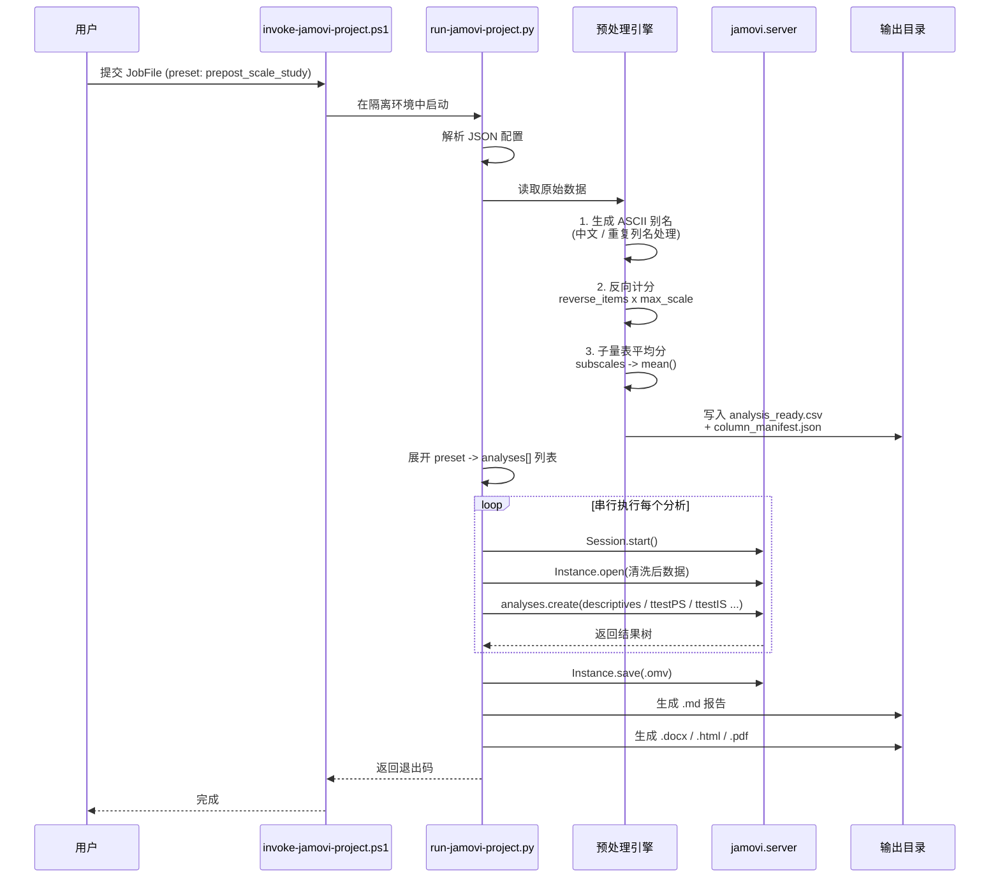

# Jamovi 自动化分析引擎 (Jamovi Analysis)

> 🇺🇸 [View English README](README.md)

Jamovi Analysis 是一个专为自动化调用本地 [jamovi](https://www.jamovi.org/) 统计软件而设计的集成工具库。它作为一个中间层，允许外部脚本或 AI Agent 通过程序化代码或**自然语言**的方式触发高级统计分析，无需打开 jamovi 的图形用户界面（GUI），即可直接生成规范的 `.omv` 项目文件与统计报告。

---

## 项目结构

```
jamovi-analysis/
├── agents/
│   └── openai.yaml          # OpenAI Agent 接口配置
├── assets/
│   └── apa-template.docx    # APA 格式 DOCX 报告模板
├── examples/                # 可运行示例数据集与期望输出
│   ├── cross_sectional_survey/
│   ├── prepost_scale_study/
│   ├── regression_study/
│   ├── reliability_study/
│   └── ttest_study/
├── references/
│   ├── analysis-map.md      # jmv 函数映射表 & 项目模式分析覆盖范围
│   ├── development-plan.md  # 开发路线图与已完成阶段
│   ├── install-layout.md    # 本地 jamovi 安装路径参考
│   ├── output-templates.md  # 提取器规范输出键与契约
│   ├── project-mode.md      # 结构化规格契约、度量规则 & 生命周期
│   └── reporting-templates.md # APA 第7版表格模板规范
├── scripts/
│   ├── find-jamovi.ps1              # 自动寻址 jamovi 安装目录
│   ├── invoke-jamovi-project.ps1    # 核心入口：生成 .omv 工程文件 + Markdown 报告
│   ├── invoke-jamovi-r.ps1          # 通过 jamovi 内置 R 环境执行批量统计
│   ├── preflight-jamovi-project.ps1 # 运行前能力检查
│   ├── run-jamovi-project.py        # 核心 Python 执行器（勿直接调用）
│   └── start-jamovi-server.ps1      # 启动交互式 jamovi.server 进程
├── src/jamovi_runner/       # 核心 Python 包
│   ├── extract/             # 9 种 jamovi 分析的结果提取器
│   ├── reporters/           # Markdown/DOCX/HTML/PDF/LaTeX 报告生成器
│   ├── formatting.py        # APA 数字/格式工具函数
│   ├── preprocess.py        # 数据清洗、别名化、反向计分
│   ├── report.py            # Markdown 报告构建器（GFM & APA 7th）
│   └── schema.py            # JobFile 校验模式
├── templates/
│   ├── input/               # 5 种研究类型的起始 CSV 模板
│   └── output/              # 标准 APA Markdown 表格模板
├── tests/                   # pytest 测试套件（109 项测试）
├── vendor/
│   └── jamovi-python/       # 内嵌的 python-docx、markdown、lxml
├── pytest.ini               # 测试配置
├── SKILL.md                 # AI Agent 技能清单（Skill Manifest）
├── README.md                # 英文版说明文档
└── README_zh.md             # 本文件（中文版）
```

---

## 核心功能与运行模式

### 标准 JobFile 接口

**推荐**的使用方式是通过统一的 **JobFile** —— 一个 JSON 配置文件，声明数据源、预处理规则、分析请求、区域设置和输出位置。

```powershell
& '.\scripts\invoke-jamovi-project.ps1' -JobFile '.\temp\job.json'
```

输出控制：
- `output.table_style`: `gfm`（默认）或 `apa`
- `output.export`: `{ enabled: true, formats: ["pdf", "html", "latex"] }`

### 数据预处理层

通过 JobFile 调用时（或 `request_kind` 为 `preset` / `structured` 时），执行器会自动：

1. **读取原始数据**（`.csv`、`.tsv`、`.xlsx`），自动检测分隔符和编码。
2. **生成安全的 ASCII 别名**（中文、重复或含特殊字符的列名 → `var_2`、`q24_rev` 等稳定标识符）。
3. **计算反向计分题项**（使用 `max_scale`，例如 `q24=2` 且 `max_scale=5` → `q24_rev=4.0`）。
4. **计算子量表平均分**（根据 item 分组）。
5. **输出**清洗后的 `analysis_ready.csv` 和 `column_manifest.json`（别名 ↔ 原始列名映射）。

### 飞行前检查（Preflight）

在运行真实分析前，可先执行独立的能力检查：

```powershell
& '.\scripts\preflight-jamovi-project.ps1'
```

检查报告包括：
- `python-docx`、`markdown`、`weasyprint` 是否可用
- 当前可用的输出格式
- 默认导出的格式中哪些实际可启用

项目模式不再尝试运行时 `pip install`。可选的报告依赖统一来自仓库内的 `vendor/jamovi-python` 目录。

### 预设模式（Preset Mode）

对于标准教育/心理学调查数据，使用 `request_kind: "preset"` 来自动化完整分析流程。当前支持：

- **`prepost_scale_study`**：自动展开为
  - `descriptives`（前测/后测/差分子量表，按 group/cluster 拆分）
  - `ttestPS`（各子量表前后测配对比较）
  - `ttestIS`（提供 group_column 时，比较差值 by 分组）

### APA 第7版报告生成

设置 `output.table_style: "apa"` 即可生成符合出版要求的表格：
- 自动表格编号（*Table 1*、*Table 2*）
- 斜体统计符号（*M*、*SD*、*t*、*p*、*F*、*β*、*η²p*）
- 规范的小数位数和前导零规则
- 通过 `python-docx` 导出带 APA 边框的 DOCX 文档

详见 `templates/output/` 中的标准 APA 表格模板，以及 `references/reporting-templates.md` 完整规范。

### 中文本地化

在 JobFile 中设置 `locale: "zh"`（或在命令行使用 `-Locale zh`）可生成中文 UI 标签的 `.omv` 项目文件（如"信度分析"、"描述统计"）。默认为 `zh`。

### 分阶段耗时统计

JSON 输出和 Markdown 报告中均包含详细的时间拆分：

```
Total Time: 3.29s
  Phases: Preprocess 0.00s | Open 0.60s | Run 1.81s | Save 0.06s
```

---

## 运行模式

### 1. 项目模式 — JobFile（推荐）

**预设模式** — 全自动调查分析：
```json
{
  "data_path": "C:/data/raw_study.xlsx",
  "mode": "project",
  "locale": "zh",
  "request_kind": "preset",
  "preset": {
    "name": "prepost_scale_study",
    "id_column": "user_id",
    "group_column": "class_group",
    "max_scale": 5,
    "reverse_items": ["q24", "q25", "q26"],
    "subscales": {
      "creativity": ["q01", "q02", "q03"],
      "algorithmic": ["q09", "q10", "q11"]
    }
  },
  "output": {
    "dir": "C:/data/jamovi_outputs",
    "basename": "ct-core-analysis",
    "table_style": "gfm",
    "export": {
      "enabled": true,
      "formats": ["pdf", "html", "latex"]
    }
  }
}
```

```powershell
& '.\scripts\invoke-jamovi-project.ps1' -JobFile '.\temp\job.json'
```

**结构化模式** — 指定分析并附带预处理：
```json
{
  "data_path": "C:/data/study.csv",
  "mode": "project",
  "request_kind": "structured",
  "analyses": [
    {"analysis_type": "descriptives", "variables": {"vars": ["score", "age"], "splitBy": ["group"]}},
    {"analysis_type": "ttestIS", "variables": {"vars": ["score"], "group": "group"}}
  ],
  "output": {
    "basename": "study-report",
    "table_style": "gfm"
  }
}
```

### 2. 项目模式 — 旧版 CLI

保留向后兼容：

```powershell
# 自然语言
& '.\scripts\invoke-jamovi-project.ps1' `
  -DataPath 'C:\data\study.csv' `
  -Request 'Run descriptives for score and age'

# 结构化 JSON
& '.\scripts\invoke-jamovi-project.ps1' `
  -DataPath 'C:\data\study.csv' `
  -SpecJson '{"analysis_type":"ttestIS","variables":{"vars":["score"],"group":"group"}}'
```

### 3. R 语言批处理模式 — 终端快速统计

```powershell
& '.\scripts\invoke-jamovi-r.ps1' -Code 'library(jmv); descriptives(data.frame(x=c(1,2,3,4,5)), vars="x")'
```

### 4. 交互式服务模式

```powershell
& '.\scripts\start-jamovi-server.ps1'
```

---

## v1 已支持的分析类型

| 分析名称 | `jmv` 函数 | 提取支持 |
|---|---|---|
| 描述性统计 | `descriptives` | ✅ |
| 独立样本 T 检验 | `ttestIS` | ✅ |
| 配对样本 T 检验 | `ttestPS` | ✅ |
| 单因素方差分析（One-Way ANOVA） | `anovaOneW` | ✅ |
| 相关矩阵 | `corrMatrix` | ✅ |
| 线性回归 | `linReg` | ✅ |
| 二元逻辑回归 | `logRegBin` | ✅ |
| 列联表卡方检验 | `contTables` | ✅ |
| 信度分析（Cronbach α） | `reliability` | ✅ |

> v1 项目模式暂不支持 PCA、EFA 及 CFA。

---

## 架构

```
用户 / AI Agent
      │
      │  写入 job.json (JobFile)
      ▼
┌────────────────────────────────────┐
│  invoke-jamovi-project.ps1         │  ← PowerShell 入口
│  (环境隔离 + 路由)                 │
└──────────────┬─────────────────────┘
               │  调用 jamovi 内置 python.exe
               ▼
┌────────────────────────────────────┐
│  run-jamovi-project.py             │  ← Python 核心执行器
│  ┌────────────┐                    │
│  │ 预处理      │ → analysis_ready.csv + column_manifest.json
│  │ 预设展开    │ → 生成 analyses[] 列表
│  ├────────────┤                    │
│  │ Session     │ → jamovi.server.Session（内部引擎）
│  │  └ open()   │ → 加载数据集
│  │  └ create() │ → 逐个创建分析
│  │  └ poll()   │ → 等待计算完成
│  │  └ save()   │ → 保存 .omv 工程
│  ├────────────┤                    │
│  │ 结果提取    │ → 从结果树提取关键统计量
│  │ 报告生成    │ → 生成 Markdown 报告
│  └────────────┘                    │
└────────────────────────────────────┘
               │
               ▼
         两类输出文件：
         ├── *.omv   （jamovi 工程文件，可直接在 GUI 中打开）
         └── *.md    （包含统计表格的 Markdown 报告）
```

### Mermaid 架构图

> GitHub 原生支持渲染 Mermaid 图表。若无法显示，请在 GitHub 上查看或使用兼容的 Mermaid 查看器。

#### 整体系统架构

```mermaid
flowchart TB
    subgraph Input["输入层"]
        U[用户 / AI Agent]
        JF[JobFile<br/>JSON 配置]
        Leg[旧版 CLI<br/>-DataPath -SpecJson -Request]
    end

    subgraph Entry["入口层 (PowerShell)"]
        FIND[find-jamovi.ps1<br/>自动寻址安装路径]
        INV[invoke-jamovi-project.ps1<br/>参数路由与校验]
        PREF[preflight-jamovi-project.ps1<br/>能力检查]
        R[invoke-jamovi-r.ps1<br/>R 批处理模式]
        SRV[start-jamovi-server.ps1<br/>交互式后端]
    end

    subgraph Isolate["环境隔离"]
        E1[清除 PYTHONHOME<br/>PYTHONPATH VIRTUAL_ENV]
        E2[清除 CONDA_* 变量]
        E3[注入 jamovi 内置<br/>Python / R 路径]
        E4[vendor/jamovi-python<br/>私有依赖]
    end

    subgraph Core["核心执行层 (Python)"]
        RUN[run-jamovi-project.py]
        PARSE[JobFile 解析<br/>校验]
        PRE[数据预处理<br/>analysis_ready.csv + manifest]
        PRESET[预设展开器<br/>prepost_scale_study]
        ENG[jamovi.server API 调用]
        EXT[结果提取器<br/>Markdown 报告生成]
    end

    subgraph Engine["jamovi 内部引擎"]
        SES[Session]
        INST[Instance]
        DATA[数据集加载<br/>open()]
        ANA[分析执行<br/>create() + poll()]
        SAVE[工程保存<br/>save() -> .omv]
    end

    subgraph Output["输出层"]
        OMV["*.omv<br/>(jamovi 工程文件)"]
        MD["*.md<br/>(Markdown 报告)"]
        DOCX["*.docx<br/>(APA Word 报告)"]
        HTML["*.html<br/>(可选导出)"]
        PDF["*.pdf<br/>(weasyprint 导出)"]
    end

    U --> JF
    U --> Leg
    JF --> INV
    Leg --> INV
    INV --> FIND
    INV --> Isolate
    Isolate --> RUN
    RUN --> PARSE
    PARSE --> PRE
    PARSE --> PRESET
    PRE --> ENG
    PRESET --> ENG
    ENG --> SES
    SES --> INST
    INST --> DATA
    DATA --> ANA
    ANA --> SAVE
    SAVE --> EXT
    EXT --> OMV
    EXT --> MD
    EXT --> DOCX
    MD --> HTML
    MD --> PDF

    style Input fill:#e1f5fe
    style Entry fill:#fff3e0
    style Core fill:#e8f5e9
    style Engine fill:#fce4ec
    style Output fill:#f3e5f5
```

#### 预设模式流水线（时序图）



---

## 环境依赖与运行时隔离

- 必须安装本地台式机版本的 **jamovi**。封装脚本具备**全盘动态寻址**能力，会自动检索 Windows 注册表及标准应用目录，无缝支持自定义安装路径（C、D、E 盘等）。
- 执行入口为 **Windows PowerShell**。
- **环境强隔离**：为避免与系统中的 Python、Conda 等外部环境冲突，脚本在每次启动前会清理 `PYTHONHOME`、`PYTHONPATH`、`VIRTUAL_ENV` 及所有继承的 `CONDA_*` 环境变量，**严格锁定使用 jamovi 闭环内绑定的解释器**进行作业。
- **最小化依赖**：预处理层仅使用 Python 标准库和 `openpyxl`（jamovi 内置）。可选导出使用 `python-docx` 生成 DOCX、`weasyprint` 生成 PDF。

---

## 输出产物

每次运行会生成以下文件：

| 文件 | 说明 |
|---|---|
| `*.omv` | 标准 jamovi 工程文件，可直接在 jamovi GUI 中打开 |
| `*.md` | Markdown 报告，包含列映射、关键结果表格、分阶段耗时 |
| `*.docx` | 基于 APA 模板生成的 Word 报告（python-docx） |
| `*.html` | Markdown 报告的 HTML 导出（启用时） |
| `*.pdf` | Markdown 报告的 PDF 导出（启用且 weasyprint 可用时） |
| `*.zip` | Markdown 报告的 LaTeX 包导出（启用时） |
| `analysis_ready.csv` | 使用 ASCII 别名后的清洗数据集（启用预处理时） |
| `column_manifest.json` | 别名 ↔ 原始列名映射字典 |

---

## 开发

### 运行测试

项目包含完整的 pytest 测试套件：

```bash
python -m pytest tests/ -v
```

主要测试模块：
- `test_extract.py` — 结果提取器正确性
- `test_preprocess.py` — 数据清洗与模板验证
- `test_report.py` — APA 表格格式化
- `test_template_regression.py` — 示例目录结构与输出匹配
- `test_integration.py` — 执行器脚本结构检查

---

## 参考文档

| 文件 | 用途 |
|---|---|
| [`references/install-layout.md`](references/install-layout.md) | 已验证的本地 jamovi 安装路径（Python、R、模块目录） |
| [`references/analysis-map.md`](references/analysis-map.md) | `jmv` 函数映射表与项目模式分析覆盖范围 |
| [`references/project-mode.md`](references/project-mode.md) | 结构化规格契约、度量类型规则、生命周期与超时处理 |
| [`references/output-templates.md`](references/output-templates.md) | 提取器规范输出键与效应量推导规则 |
| [`references/reporting-templates.md`](references/reporting-templates.md) | 完整 APA 第7版表格模板与符号映射 |

---

## 输出验证

在修改 Python 执行器后，可以不启动 jamovi GUI 而直接验证 `.omv` 产物的合法性：

```python
from zipfile import ZipFile

with ZipFile("report.omv") as archive:
    names = archive.namelist()
    assert "metadata.json" in names
    assert any(name.endswith("/analysis") for name in names)
```

每次修改执行器后，务必通过 `invoke-jamovi-project.ps1` 执行真实的冒烟测试。
